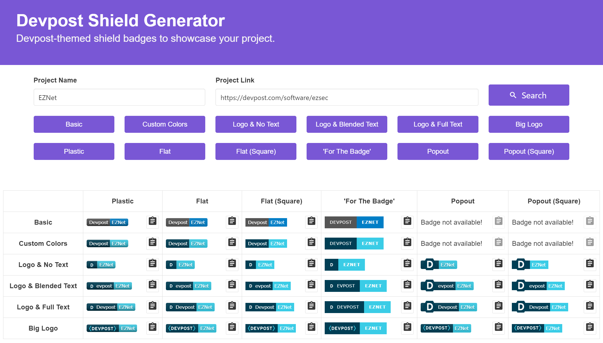

# devpost-shields
Devpost-themed shield badges to showcase your project. Powered by the same tech that [shields.io](https://shields.io) uses!



## Why?
I've been to many hackathons who use Devpost as their method of submitting projects. I also have a lot of projects on GitHub which are primarily hackathon projects and I wanted to showcase that fact. Sure, I could have just pasted a link to the Devpost submission but that's boring. :stuck_out_tongue:

## Don't want to use the web interface?
We got you covered! You can use the following format to create your own badges with ease.

#### How to create the badge image:
```
https://badges.devpost-shields.com/get-badge?name=project-name&id=project-id&type=badge-type&style=badge-style
```
* *project-name* = the name of the project that will be displayed on the badge
* *project-id* = the id of the project (from https://devpost.com/software/project-id)
* *badge-type* = one of the six badge types that you can choose from as shown below
  * `basic` - Basic (Doesn't work with `popout` and `popout-square`)
  * `custom-color` - Custom Color (Doesn't work with `popout` and `popout-square`)
  * `small-logo-left-text-none` - Logo & No Text
  * `small-logo-left-text-blend` - Logo & Blended Text
  * `small-logo-left-text-full` - Logo & Full Text
  * `big-logo` - Big Logo
* *badge-style* = one of the six badge styles that you can choose from as shown below
  * `plastic` - Plastic
  * `flat` - Flat
  * `flat-square` - Flat (Square)
  * `for-the-badge` - "For The Badge"
  * `popout` - Popout (Doesn't work with `basic` and `custom-color`)
  * `popout-square` - Popout (Square) (Doesn't work with `basic` and `custom-color`)

#### How to embed the badge in markdown:
```
[](devpost-link)
```
* *devpost-project-name* - the name of the project on Devpost (or really anything that you want)
* *badge-image-url* - the badge image URL that you created above
* *devpost-link* - the link to the devpost project (or really anything that you want)

## How to use
1. Go to the website [here](https://devpost-shields.com/).
2. Find any Devpost project that you've posted. A table of badges will be generated as shown above.
3. The types of badges are stated by the row labels and the styles are stated by the column labels. You can click on the buttons above to hide certain rows and columns.
4. Click on the clipboard icon for any of the badges. The resulting markdown will be copied to your clipboard.
5. Paste it on any markdown file (like your README), and the badge will instantly load whenever the markdown file is rendered.

## Powered by...
* *Vue.js*, for the frontend logic
* *Node.js*, for the backend logic
* *gh-badges*, the same npm module from the authors that created shields.io
* *AWS Lambda*, for serving badges to your markdown pages
* *GitHub Pages*, for hosting the website itself
* *Route 53*, for the custom domain